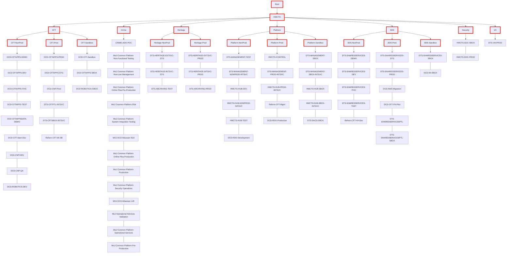

# Azure Enterprise

Inspired by [Azure/terraform-azurerm-caf-enterprise-scale](https://github.com/Azure/terraform-azurerm-caf-enterprise-scale).
Simplified for our use-cases / retrofitting.



## Diagram setup

The diagram above is generated automatically from the subscriptions listed in `environments/prod/prod.tfvars` via a [GitHub Action](.github/workflows/create-mermaid-diagram.yml).


Empty management groups will not be shown in the diagram.

The script works on both macOS and Linux.

Management group nodes are highlighted with a thick red border as denoted by `:::mg`. Subscription nodes use the default blue/grey border.

## New subscription

### Naming the subscription

First you will need to decide on a name for the new subscription you want.

The format is `${department}-${service}-${environment}`

Department is normally `DTS`
For all of HMCTS e.g. CFT, Crime, SDS, then use `HMCTS`.

Service is a short name that normally maps to the project or group of projects.
e.g. BAR (banking and returns) or CFT, (Civil, Family and Tribunals group of projects).

Environment is one of the allowed environments names:
- SBOX (Sandbox)
- TEST
- ITHC (IT healthcheck)
- DEMO
- STG (Staging)
- PROD

Example subscription names:
- DTS-CFTAPPS-PROD
- HMCTS-HUB-PROD
- DTS-DOCMOSIS-PROD

### Creating the subscription

Request approval for a new subscription by emailing "DTS Platform Operations"

Once approved create a pull request adding the required subscriptions.

Modify the file [prod.tfvars](https://github.com/hmcts/azure-enterprise/blob/main/environments/prod/prod.tfvars) with the subscription name.
   * add it into the corresponding management group e.g. for a new heritage production subscription add it to the `heritage_production_subscriptions` variable.

   ```
   heritage_production_subscriptions = {
    DTS-HERITAGE-STG = {}
   }
   ```
  
The environment is required to bootstrap the subscription. Most subscriptions have the environment name in the subscription name e.g. DTS-SHAREDSERVICES-DEV. The environment will be extracted automatically where this naming convention is followed. If a subscription does not follow this naming convention, then you must specify the environment in the tfvars file.

   ```
   heritage_production_subscriptions = {
    DTS-HERITAGE-NLE = {
      environment = "stg"
    }
   }
   ```

Create a 'help request' in the [#platops-help](https://hmcts-reform.slack.com/app_redirect?channel=platops-help) Slack channel if you have any questions.

## Adding a new management group

1. Add the required management variables to [variables.tf](https://github.com/hmcts/azure-enterprise/blob/main/components/enterprise/variables.tf)
   * for a new Constoso group, copy an existing `_subscriptions` variable and name it `contoso_subscriptions`
2. Add a variable override to [prod.tfvars](https://github.com/hmcts/azure-enterprise/blob/main/environments/prod/prod.tfvars) this will be used for all the subscriptions in the management group
   * an empty group would be `contoso_subscriptions = {}`
3. Add your new management group to [enterprise.tf](https://github.com/hmcts/azure-enterprise/blob/main/components/enterprise/enterprise.tf)
4. Ensure you update the `subscription.group` field to a key that represents your management group, e.g. `crime_non_production`
5. Add your new management group to [subscriptions.tf](https://github.com/hmcts/azure-enterprise/blob/main/components/enterprise/subscriptions.tf)
   - make sure you add a new `local` variable for the management group and modify the `local.subscriptions` variable to add the new local you created
6. Update the [create-mermaid-diagram script](scripts/create-mermaid-diagram.sh) to add your new management group:
   - append the top level of your new management group to the sed command on [L34](scripts/create-mermaid-diagram.sh#L34) `s/vh_subscriptions/VH:::mg/g; s/new_subscriptions/NEW:::mg/g'`
   - append the environments for your new management group to the sed command on [L37](scripts/create-mermaid-diagram.sh#L37) `Platform-Sandbox:::mg\'$'\n/g; NEW-Sandbox:::mg\'$'\n/g;'`

<!-- TODO update this when we get a better example that's just doing what is required --> 
[Example pull request](https://github.com/hmcts/azure-enterprise/pull/11)

## Renaming a subscription

In [prod.tfvars](https://github.com/hmcts/azure-enterprise/blob/main/environments/prod/prod.tfvars) your subscription will look something like:

```terraform
cft_non_production_subscriptions = {
  DCD-CFTAPPS-DEV = {}
}
```

Modify it to include a `display_name` property:

```diff
diff --git a/environments/prod/prod.tfvars b/environments/prod/prod.tfvars
index 9b27139..4a8f1c0 100644
--- a/environments/prod/prod.tfvars
+++ b/environments/prod/prod.tfvars
@@ -9,7 +9,9 @@ cft_production_subscriptions = {
 cft_non_production_subscriptions = {
-  DCD-CFTAPPS-DEV  = {}
+  DTS-CFTAPPS-DEV  = {
+    display_name = "DTS-CFTAPPS-DEV"
+  }
```

The terraform plan will then only show a subscription name change, and it will be updated in-place:

```hcl
Terraform will perform the following actions:

  # module.subscription["DCD-CFTAPPS-DEV"].azurerm_subscription.this will be updated in-place
  ~ resource "azurerm_subscription" "this" {
        id                = "/providers/Microsoft.Subscription/aliases/DCD-CFTAPPS-DEV"
      ~ subscription_name = "DCD-CFTAPPS-DEV" -> "DTS-CFTAPPS-DEV"
        tags              = {}
        # (4 unchanged attributes hidden)
    }
```

## Moving a subscription to a different 'Management group'

Subscriptions can be easily moved to different management groups by moving it between variables in [prod.tfvars](https://github.com/hmcts/azure-enterprise/blob/main/environments/prod/prod.tfvars).

```diff
diff --git a/environments/prod/prod.tfvars b/environments/prod/prod.tfvars
index 9b27139..8affa55 100644
--- a/environments/prod/prod.tfvars
+++ b/environments/prod/prod.tfvars
@@ -4,12 +4,12 @@ cft_sandbox_subscriptions = {

 cft_production_subscriptions = {
+  DTS-CFTAPPS-STG  = {}
 }

 cft_non_production_subscriptions = {
-  DTS-CFTAPPS-STG  = {}
 }
```

The terraform plan will then only show a change to the management group:

```hcl
Terraform will perform the following actions:

  # module.enterprise.azurerm_management_group.level_3["CFT-NonProd"] will be updated in-place
  ~ resource "azurerm_management_group" "level_3" {
        id                         = "/providers/Microsoft.Management/managementGroups/CFT-NonProd"
        name                       = "CFT-NonProd"
      ~ subscription_ids           = [
          - "06069648-d13b-4c3c-9367-f3a1ed8e38bc",
            # (2 unchanged elements hidden)
        ]
        # (2 unchanged attributes hidden)
    }

  # module.enterprise.azurerm_management_group.level_3["CFT-Prod"] will be updated in-place
  ~ resource "azurerm_management_group" "level_3" {
        id                         = "/providers/Microsoft.Management/managementGroups/CFT-Prod"
        name                       = "CFT-Prod"
      ~ subscription_ids           = [
          + "06069648-d13b-4c3c-9367-f3a1ed8e38bc",
            # (1 unchanged element hidden)
        ]
```

## Importing an existing subscription

_Note: before you begin, one of the resources to be imported is a service endpoint for Azure DevOps.
This will require you to create a Personal Access Token with `Service Connections (Read, query & manage)` permissions which you can use in an environment variable along with the organisation URL to authenticate the microsoft/azuredevops terraform provider.
See [the provider documentation](https://registry.terraform.io/providers/microsoft/azuredevops/latest/docs#argument-reference)._

If you don't have permission to manage service connections, ask a colleague for help.

1. Add the subscription to the `prod.tfvars` file under the appropriate management group, adding the necessary variables as appropriate - see [Creating a subscription](#creating-the-subscription).

2. Create a pull request.

   You will see the terraform plan in the Azure DevOps pipeline run and changes should be commented on your pull request.

   Terraform will attempt to create some resources that already exist such as Azure AD groups, applications or key vault secrets. These will need imported to terraform state to avoid errors on apply.

   A [bash script](scripts/terraform-import.sh) has been provided to automate this process.

3. Before running the bash script, ensure you have azure-cli installed and logged in. Ensure terraform and jq are installed also.

4. Create a file called subscriptions.json in the scripts folder and create a json array with the subscription to be imported and its details e.g.

```json
   [
      {
         "subscription_name": "DCD-CFT-Sandbox", "deploy_acme": "true", "environment": "sbox"
      },
      {
         "subscription_name": "DCD-CFTAPPS-SBOX", "deploy_acme": "true", "environment": "sbox"
      }
   ]
```

An [example file](scripts/subscriptions.json.example) has also been provided.

5. Run terraform init inside the components/enterprise directory for the environment you are targeting.

6. Run the script from the components/enterprise directory without any flags to perform a dry-run i.e. `scripts/terraform-import.sh`. The script will output the resources to be imported and their address IDs. Check these values are expected.

7. If the values returned by the dry-run are correct, run the script again and append `--import`. This will run `terraform import`.

   Terraform will attempt to import the resources to the address IDs.

## Cancelling a subscription

There are two options for cancelling a subscription depending on how confident you are the subscription is not in use:

### Removing from terraform

> Use this option when you are sure the subscription is not in use

Currently, it is not possible to cancel a subscription if it contains resources.

So to cancel the subscription you need to:

1. Delete any existing resources
2. Remove the subscription from this repository
3. Verify pipeline succeeded
4. Wait ~30 minutes for the portal to update and check it is in a disabled state

It will then stay for 90 days or can be force deleted after 72 hours.

There are feature requests open to allow a subscription soft-delete with resources inside it, see:
- [hashicorp/terraform-provider-azurerm #12264 (Support for IgnoreResourceCheck when cancelling a subscription)](https://github.com/hashicorp/terraform-provider-azurerm/issues/12264)
- [Azure/azure-rest-api-specs #20254 (Ignore existing resources within a subscription)](https://github.com/Azure/azure-rest-api-specs/issues/20254)

### Portal

> Use this option when you aren't sure if the subscription is still in use as it allows you to reactivate

Cancelling through the portal disables the subscription, blocks access to resources and stops the billing.
It will be automatically deleted after 90 days or can be force deleted after 72 hours.

Once the subscription has been fully deleted it can be removed from terraform.

## Adding another tenant

We aim to manage the subscriptions for all our tenants as part of this repository, that way we have one place to manage the enterprise from.

Each tenant needs to have a local user account and to have its own enrolment account where the user account is the account admin.

### Service principal creation

1. Add your account as a guest to the tenant with the Global Administrator role
2. Create a service principal in the tenant and add the 'Global Administrator' role to it, name it "DTS <tenant> Operations GA"
3. Assign the Owner role to the Root Management Group of the tenant to the service principal
4. Create a subscription in the tenant that will be used for storing terraform state
   * Name it something like `DTS-<tenant>-CONTROL-PROD`, or `DTS-<tenant>-MGMT-PROD`
   * You can use the Service Principal that the CJS Common Platform tenant uses
   * Create a Terraform resource in a temporary folder, assign yourself owner of the subscription created
   * Use the 'Change directory' button in the Azure portal to move the subscription to the tenant
5. In the 'PlatformOperations' Azure DevOps project create a new service connection 'DTS-<tenant>-GA'

### Enrolment account Setup

1. Ensure there is a custom domain assigned to the tenant, we do not want to use onmicrosoft tenants
   * If there is no custom domain then create one and verify it
2. Create a user account in the tenant, name it `dtsazure@<custom-domain>`, it should have a complex password and 2fa if possible in the tenant.
3. Assign the user account Global Administrator
4. Invite dtsazure@hmcts.net to the tenant if it's not already present, this account should have visibility over all tenants
5. Ask the EA Administrators to create an enrolment account in the HMCTS department
   * named after the tenant, usually something like 'DTS <tenant name' 
   * account admin as `dtsazure@<custom-domain>`
   * If it's going to have subscriptions for Dev/Test ask them to enable the Dev/Test offer on the account
6. Log into the [EA portal](https://ea.azure.com) using the tenant user `dtsazure@<custom-domain>`
   * You will need to fill out some profile information
   * Once completed you should be signed in to the EA portal and able to see the enrolment account
   * Wait a couple of hours, this takes an unknown amount of time to replicate and actually grant permissions
   * Go to the [Azure portal](https://portal.azure.com)
     * Login with the `dtsazure@<custom-domain>` account, click Subscriptions, click create
     * You should see a screen with the MoJ enterprise agreement and a dropdown to select the enrolment account. If the enrolment account is missing then check back later

### Service principal permission delegation

Follow the [Microsoft documentation to delegate permissions to the service principal](https://docs.microsoft.com/en-us/azure/cost-management-billing/manage/grant-access-to-create-subscription?tabs=rest%2Crest-2).

You can click the 'Try it' button from the [Microsoft REST API docs](https://docs.microsoft.com/en-us/rest/api/billing/2019-10-01-preview/enrollment-account-role-assignments/put?tabs=HTTP) to do this.

If you get a 400 error check you're using the right principal ID, application registrations and enterprise application have different IDs, try the other one.

### Terraform setup

Copy an existing component, the `video-hearings` folder is a good example for a standalone tenant, or `prod` for a larger tenant with lots of subscriptions.

## Automated Certificate Management Environment (ACME)

Some subscriptions may require a function app and related resources to automatically create and manage SSL certficates from Let's Encrypt.

These resources are managed and maintained in another repository: [hmcts/azure-enterprise-acme](https://github.com/hmcts/azure-enterprise-acme)

Whilst there are dependencies on this repository, any updates specific to ACME resources should be managed there.

## Azure DevOps manual service connection secret auto-rotation

This repo contains code to create service connections in Azure DevOps.

These service connections are backed by Azure AD Service Principals with client secrets.

The client secrets are generated using the `azuread_application_password` resource.

In order to automatically manage the rotation of these secrets, a `time_rotating` terraform resource has been used in conjunction with `azuread_application_password`.

The Azure DevOps pipeline will run automatically every day at 8am to refresh the terraform state which contains the rotation timestamp.

When the timestamp is surpassed by the current time, the `time_rotating` resource will be refreshed and the `azuread_application_password` token will be updated to a newly generated value.

This value will then be used to update the service connection in Azure DevOps.

## Creating and assigning custom roles

### Creating a custom role 

To create a custom role you need to update the [locals.tf](./modules/enterprise/locals.tf) file in the enterprise module and update the `custom_roles` local value with the name of the role, the description, the scope and the actions allowed.

```terraform
  custom_roles = {
    "Application Gateway Backend Health Reader" = {
      description = "View backend health on the Application Gateway"
      scope       = "/providers/Microsoft.Management/managementGroups/HMCTS"
      actions     = ["Microsoft.Network/applicationGateways/backendhealth/action"]
    },
  }
```

### Assigning custom roles

To assign a Custom Role, the role itself needs to be created in this repo first using the instructions above.

Once the role has been created we can assign it by updating the [locals.tf](./modules/subscription/locals.tf) file in the subscription module. You will need to add the name of the custom role, the ID of the principal being assigned to the role and the scope of the permission.

```terraform
  custom_role_assignments = {
    "Application Gateway Backend Health Reader" = {
      principal_id = azuread_group.groups["Reader"].id
      scope        = "/subscriptions/${azurerm_subscription.this.subscription_id}"
    },
  }
```

